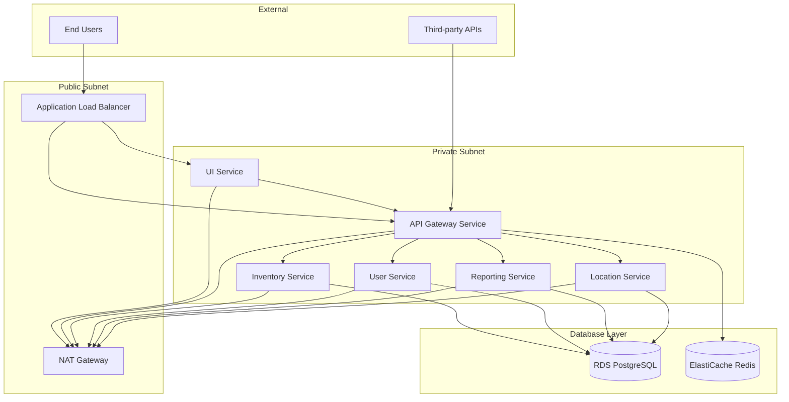
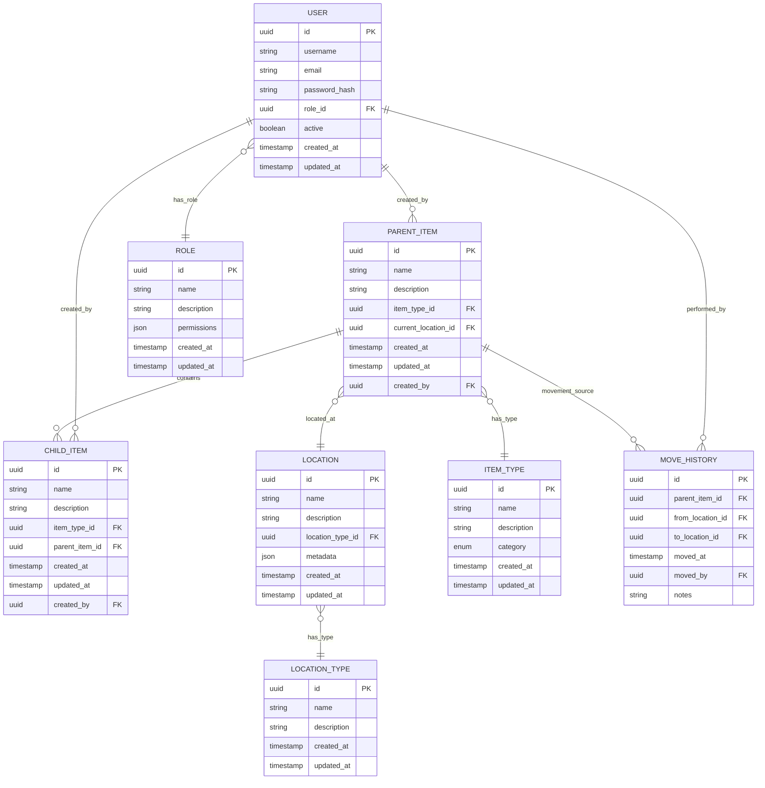

# Design Document: Inventory Management System

## Overview

The inventory management system is designed as a cloud-native microservices architecture deployed on AWS Fargate. The system manages parent and child items across multiple locations, provides comprehensive tracking and reporting capabilities, and supports role-based user access. The architecture follows modern containerization practices with Infrastructure as Code (IaC) using Terraform for reproducible deployments.

The system consists of three primary layers: API services, UI layer, and data persistence layer, all orchestrated through AWS ECS Fargate with automatic scaling and high availability.

## Architecture

### High-Level Architecture



### Microservices Architecture

The system is decomposed into the following microservices:

1. **API Gateway Service**: Central entry point for all API requests, handles authentication, rate limiting, and request routing
2. **Inventory Service**: Manages parent items, child items, and their relationships
3. **Location Service**: Manages locations, location types, and item movements
4. **User Service**: Handles authentication, authorization, and user management
5. **Reporting Service**: Generates reports and analytics on inventory data
6. **UI Service**: Serves the web-based user interface

### Infrastructure Components

- **AWS ECS Fargate**: Serverless container orchestration
- **Application Load Balancer (ALB)**: Traffic distribution and SSL termination
- **Amazon RDS PostgreSQL**: Primary database with Multi-AZ deployment
- **Amazon ElastiCache Redis**: Caching layer for improved performance
- **VPC with Public/Private Subnets**: Network isolation and security
- **NAT Gateway**: Outbound internet access for private subnet services
- **CloudWatch**: Logging, monitoring, and alerting

## Components and Interfaces

### API Gateway Service

**Responsibilities:**
- Request authentication and authorization
- Rate limiting and throttling
- Request routing to appropriate microservices
- API versioning and documentation
- CORS handling for web clients

**Key Interfaces:**
- REST API endpoints for all system operations
- JWT token validation
- Service-to-service communication via internal APIs

### Inventory Service

**Responsibilities:**
- Parent item lifecycle management (CRUD operations)
- Child item lifecycle management (CRUD operations)
- Item type management
- Parent-child item relationships
- Item assignment and reassignment logic

**Key Interfaces:**
- `/api/v1/items/parent` - Parent item operations
- `/api/v1/items/child` - Child item operations
- `/api/v1/items/types` - Item type management
- `/api/v1/items/assignments` - Item relationship management

### Location Service

**Responsibilities:**
- Location and location type management
- Item movement tracking and validation
- Move history recording and retrieval
- Location-based inventory queries

**Key Interfaces:**
- `/api/v1/locations` - Location management
- `/api/v1/locations/types` - Location type management
- `/api/v1/movements` - Item movement operations
- `/api/v1/movements/history` - Movement history queries

### User Service

**Responsibilities:**
- User authentication and session management
- Role-based access control (RBAC)
- User profile management
- API key management for third-party integrations

**Key Interfaces:**
- `/api/v1/auth/login` - User authentication
- `/api/v1/auth/logout` - Session termination
- `/api/v1/users` - User management
- `/api/v1/roles` - Role management

### Reporting Service

**Responsibilities:**
- Inventory status reports
- Movement history analytics
- Location-based inventory summaries
- Custom report generation
- Data export capabilities

**Key Interfaces:**
- `/api/v1/reports/inventory` - Current inventory reports
- `/api/v1/reports/movements` - Movement analytics
- `/api/v1/reports/locations` - Location-based reports
- `/api/v1/reports/export` - Data export functionality

### UI Service

**Responsibilities:**
- Web-based user interface delivery
- Static asset serving
- Client-side routing
- API integration and state management

**Key Interfaces:**
- Web application served at root path
- RESTful API consumption
- Real-time updates via WebSocket connections

## Data Models

### Core Entities



### Database Schema Considerations

- **UUID Primary Keys**: All entities use UUID primary keys for distributed system compatibility
- **Audit Fields**: All entities include created_at, updated_at, and created_by fields for audit trails
- **Soft Deletes**: Implement soft delete patterns for data retention and audit compliance
- **Indexing Strategy**: Composite indexes on frequently queried fields (location_id, item_type_id, moved_at)
- **Partitioning**: Consider partitioning move_history table by date for performance at scale

## Infrastructure Design

### Terraform Module Structure

```
terraform/
├── environments/
│   ├── dev/
│   │   ├── main.tf
│   │   ├── variables.tf
│   │   └── terraform.tfvars
│   └── prod/
│       ├── main.tf
│       ├── variables.tf
│       └── terraform.tfvars
├── modules/
│   ├── networking/
│   ├── ecs-cluster/
│   ├── ecs-service/
│   ├── rds/
│   ├── elasticache/
│   └── security/
└── shared/
    ├── variables.tf
    └── outputs.tf
```

### Network Architecture

- **VPC**: Dedicated VPC with CIDR block 10.0.0.0/16
- **Public Subnets**: 2 subnets across AZs for ALB and NAT Gateway (10.0.1.0/24, 10.0.2.0/24)
- **Private Subnets**: 2 subnets across AZs for ECS services (10.0.10.0/24, 10.0.11.0/24)
- **Database Subnets**: 2 subnets across AZs for RDS (10.0.20.0/24, 10.0.21.0/24)

### Security Groups

- **ALB Security Group**: Allow HTTP/HTTPS from internet (0.0.0.0/0)
- **ECS Security Group**: Allow traffic from ALB and internal service communication
- **RDS Security Group**: Allow PostgreSQL traffic only from ECS services
- **ElastiCache Security Group**: Allow Redis traffic only from ECS services

### Container Configuration

Each microservice runs in its own ECS service with:
- **CPU**: 256-512 CPU units per service
- **Memory**: 512MB-1GB per service
- **Auto Scaling**: Target tracking based on CPU utilization (70% threshold)
- **Health Checks**: Application-level health endpoints
- **Logging**: CloudWatch Logs with structured JSON logging

## Correctness Properties

*A property is a characteristic or behavior that should hold true across all valid executions of a system—essentially, a formal statement about what the system should do. Properties serve as the bridge between human-readable specifications and machine-verifiable correctness guarantees.*

### Property 1: Location Query Consistency
*For any* inventory query, all parent items should return their current location and all child items should appear at their parent item's location
**Validates: Requirements 1.1, 1.2**

### Property 2: Real-time Location Updates
*For any* item location update, immediately querying that item should return the new location
**Validates: Requirements 1.3, 1.4**

### Property 3: Cascading Item Movement
*For any* parent item with assigned child items, moving the parent item should result in all child items being located at the same new location
**Validates: Requirements 2.2, 9.3**

### Property 4: Movement Audit Trail
*For any* parent item movement, a move history record should be created containing source location, destination location, timestamp, and user information
**Validates: Requirements 2.3, 5.1**

### Property 5: Move Validation and Error Handling
*For any* attempted item move to a non-existent location, the operation should fail, the item should remain at its original location, and an error should be returned
**Validates: Requirements 2.4, 2.5**

### Property 6: Report Data Accuracy
*For any* generated inventory report, the data should accurately reflect current inventory status, location assignments, and item counts by type
**Validates: Requirements 3.1, 3.3**

### Property 7: Report Date Filtering
*For any* movement history report with date range filters, only movements within the specified date range should be included in chronological order
**Validates: Requirements 3.2, 5.2**

### Property 8: Referential Integrity Validation
*For any* creation operation (locations, items, assignments), all referenced entities must exist or the operation should fail with appropriate validation errors
**Validates: Requirements 4.1, 8.3, 9.1**

### Property 9: Constraint Enforcement
*For any* deletion attempt of entities with dependent relationships (locations with items, item types in use), the deletion should be prevented and return an error
**Validates: Requirements 4.4, 4.5, 8.4**

### Property 10: Child Item Assignment Uniqueness
*For any* child item, it should be assigned to at most one parent item at any given time
**Validates: Requirements 9.2**

### Property 11: Assignment History Tracking
*For any* child item reassignment between parent items, the assignment change should be recorded in the audit history
**Validates: Requirements 9.4, 9.5**

### Property 12: User Authentication and Authorization
*For any* user login attempt with valid credentials, an authenticated session should be established with appropriate role-based permissions
**Validates: Requirements 6.2, 6.3**

### Property 13: User Uniqueness and Role Management
*For any* user creation, the credentials must be unique, and role modifications should immediately update user permissions
**Validates: Requirements 6.1, 6.4**

### Property 14: API Authentication and Validation
*For any* third-party API request, authentication should be validated and request format should be checked before processing
**Validates: Requirements 7.1, 7.2**

### Property 15: API Error Response Consistency
*For any* failed API request, appropriate HTTP status codes and descriptive error messages should be returned
**Validates: Requirements 7.4**

### Property 16: Comprehensive Audit Logging
*For any* API interaction or system operation, appropriate audit logs should be created for security and compliance tracking
**Validates: Requirements 7.5, 5.3**

## Error Handling

### Error Categories and Responses

**Validation Errors (400 Bad Request)**:
- Invalid input format or missing required fields
- Referential integrity violations (non-existent references)
- Business rule violations (duplicate assignments, constraint violations)

**Authentication Errors (401 Unauthorized)**:
- Invalid credentials or expired tokens
- Missing authentication headers

**Authorization Errors (403 Forbidden)**:
- Insufficient permissions for requested operation
- Role-based access control violations

**Resource Errors (404 Not Found)**:
- Requested entity does not exist
- Invalid endpoint or resource path

**Conflict Errors (409 Conflict)**:
- Concurrent modification conflicts
- Unique constraint violations

**Server Errors (500 Internal Server Error)**:
- Database connection failures
- Unexpected system errors
- Third-party service failures

### Error Response Format

All API errors follow a consistent JSON structure:

```json
{
  "error": {
    "code": "VALIDATION_ERROR",
    "message": "The specified location does not exist",
    "details": {
      "field": "location_id",
      "value": "invalid-uuid",
      "constraint": "foreign_key"
    },
    "timestamp": "2025-01-18T10:30:00Z",
    "request_id": "req-12345"
  }
}
```

### Retry and Circuit Breaker Patterns

- **Database Operations**: Implement exponential backoff for transient failures
- **Third-party API Calls**: Circuit breaker pattern with fallback mechanisms
- **Inter-service Communication**: Retry with jitter for network-related failures

## Testing Strategy

### Dual Testing Approach

The system employs both unit testing and property-based testing to ensure comprehensive coverage:

**Unit Tests**:
- Verify specific examples and edge cases
- Test integration points between components
- Validate error conditions and boundary values
- Focus on concrete scenarios and known failure modes

**Property-Based Tests**:
- Verify universal properties across all inputs
- Test system behavior with randomized data
- Validate correctness properties through comprehensive input coverage
- Each property test runs minimum 100 iterations for statistical confidence

### Property-Based Testing Configuration

**Testing Framework**: We will use a property-based testing library appropriate for the chosen implementation language (e.g., Hypothesis for Python, fast-check for TypeScript/JavaScript, QuickCheck for Haskell).

**Test Configuration**:
- Minimum 100 iterations per property test
- Each property test references its corresponding design document property
- Tag format: **Feature: inventory-management, Property {number}: {property_text}**
- Smart generators that constrain inputs to valid system states
- Shrinking capabilities to find minimal failing examples

### Test Organization

**Unit Test Structure**:
- Co-located with source files using appropriate naming conventions
- Organized by service and component
- Include setup and teardown for test isolation
- Mock external dependencies appropriately

**Property Test Structure**:
- Separate property test files for each major component
- Each correctness property implemented as a single property-based test
- Custom generators for domain-specific data types
- Property tests validate end-to-end system behavior

### Integration Testing

**Service Integration**:
- Test inter-service communication patterns
- Validate API contract compliance
- Test database transaction boundaries
- Verify event-driven communication flows

**Infrastructure Testing**:
- Terraform plan validation
- Container health check verification
- Network connectivity testing
- Security group rule validation

### Performance and Load Testing

**Performance Benchmarks**:
- API response time targets (< 200ms for queries, < 500ms for mutations)
- Database query performance monitoring
- Memory usage and garbage collection metrics
- Container resource utilization tracking

**Load Testing Scenarios**:
- Concurrent user simulation
- High-volume inventory operations
- Report generation under load
- Third-party API integration stress testing